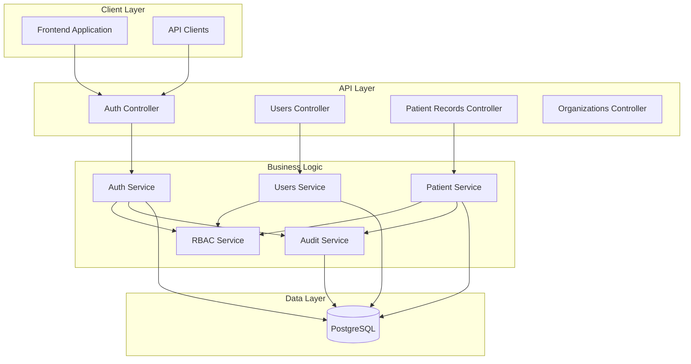
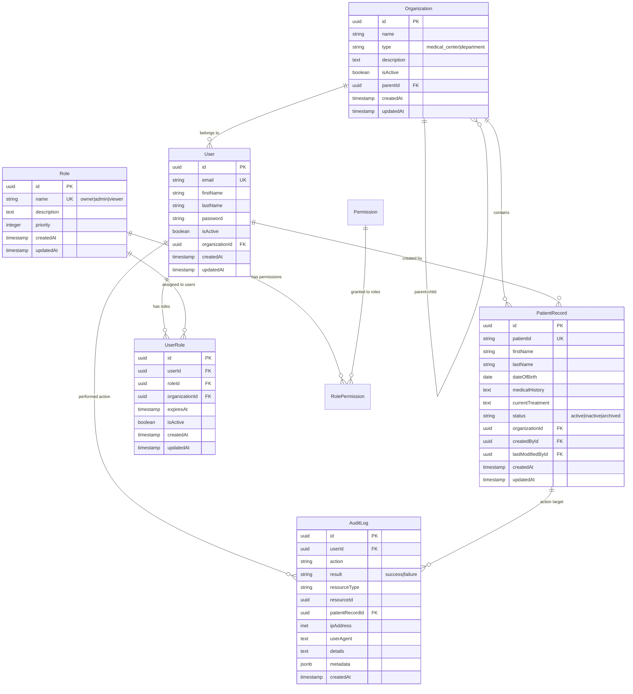

# 🏥 Veteran Healthcare RBAC System

> **A comprehensive Role-Based Access Control system for veteran healthcare applications, built with NestJS, TypeScript, and PostgreSQL.**

[](https://nestjs.com/)
[](https://www.typescriptlang.org/)
[](https://www.postgresql.org/)
[](https://opensource.org/licenses/MIT)

## 📋 Table of Contents

- [Overview](#overview)
- [Features](#features)
- [Quick Start](#quick-start)
- [Quick Demo](#quick-demo)
- [Architecture](#architecture)
- [API Documentation](#api-documentation)
- [Database Schema](#database-schema)
- [RBAC Implementation](#rbac-implementation)
- [Testing](#testing)
- [Security](#security)
- [Future Considerations](#future-considerations)

---

## 🎯 Overview

This system implements a production-ready Role-Based Access Control (RBAC) solution specifically designed for veteran healthcare environments. It provides secure, hierarchical access control with comprehensive audit logging and organizational structure support.

### Key Highlights
- **3-Tier Role System**: Owner, Admin, Viewer with inheritance
- **Organizational Hierarchy**: Medical Center → Department structure
- **Comprehensive Audit Logging**: Full activity tracking for compliance
- **JWT Authentication**: Secure token-based authentication
- **Resource-Level Permissions**: Fine-grained access control
- **Auto-Generated API Docs**: Swagger/OpenAPI integration

---

## ✨ Features

### 🔐 Authentication & Authorization
- JWT-based authentication with configurable expiration
- Role-based access control with permission inheritance
- Organizational scoping for multi-tenant support
- Automatic role assignment for new users

### 🏢 Organizational Management
- Hierarchical organization structure (Medical Center → Departments)
- Parent-child access inheritance
- Department-scoped resource access

### 📊 Patient Record Management
- Full CRUD operations with permission checking
- Organization-scoped data filtering
- Comprehensive audit trail for all operations

### 🔍 Audit & Compliance
- Complete activity logging for security compliance
- IP address and user agent tracking
- Failed access attempt logging
- Searchable audit trails

### 🧪 Testing
- Comprehensive unit test suite
- Role-based access control verification
- Service layer testing with mocked dependencies
- Authentication and authorization logic validation
- Business rule enforcement testing

---

## 🚀 Quick Start

### Prerequisites
- **Node.js** 18+ 
- **PostgreSQL** 13+ (or SQLite for development)
- **npm** or **yarn**

### Installation

1. **Clone the repository**
   ```bash
   git clone <repository-url>

2. **Install dependencies**
   ```bash
      npm install

3. **Environment setup**
   ```bash
   cp .env.example .env

4. **Database setup**
   ```bash
   # Run migrations
   npm run migration:run

   # Seed initial data (optional)
   npm run seed

5. **Start the application**
   ```bash
   # Development mode
   npm run start:dev

   # Production mode
   npm run build
   npm run start:prod

### Environment Variables
```bash
# Application
NODE_ENV=development
PORT=3000

# Database
DB_HOST=localhost
DB_PORT=5432
DB_USERNAME=postgres
DB_PASSWORD=your_password
DB_NAME=veteran_healthcare_rbac

# JWT Configuration
JWT_SECRET=your-super-secret-jwt-key
JWT_EXPIRATION=24h

# Frontend
FRONTEND_URL=http://localhost:3000
```

### Verification
- API: http://localhost:3000
- Health Check: http://localhost:3000/health
- API Documentation: http://localhost:3000/api/docs

## 🎬 Quick Demo
### Sample API workflow
1. Register as Owner (first user automatically gets OWNER role):
```bash
curl -X POST http://localhost:3000/api/auth/register \
  -H "Content-Type: application/json" \
  -d '{"email":"owner@va.gov","password":"SecurePass123!","firstName":"Jane","lastName":"Doe"}'
```
2. Login and get JWT Token
```bash
curl -X POST http://localhost:3000/api/auth/login \
  -H "Content-Type: application/json" \
  -d '{"email":"owner@va.gov","password":"SecurePass123!"}'
```
3. Authorise at the top right at swagger API with the access code
4. Create a patient record:
```bash
curl -X POST http://localhost:3000/api/patient-records \
  -H "Authorization: Bearer YOUR_JWT_TOKEN" \
  -H "Content-Type: application/json" \
  -d '{"patientId":"VET001","firstName":"John","lastName":"Smith","dateOfBirth":"1980-05-15"}'
```
5. View all patient records:
```bash
curl -X GET http://localhost:3000/api/patient-records \
  -H "Authorization: Bearer YOUR_JWT_TOKEN"
```
6. Delete a patient record:
```bash
curl -X 'DELETE' \
  'http://localhost:3000/api/patient-records/{patient-id}' \
  -H 'accept: */*' \
  -H 'Authorization: YOUR_JWT_TOKEN'
```

### Role-Based Access Demo
- Owner: Can create, read, update, and delete any resource
- Admin: Can manage patient records but cannot delete
- Viewer: Can only read patient records

Try creating additional users with different email patterns:

admin@va.gov → Gets ADMIN role \
viewer@va.gov → Gets VIEWER role


## 🏗 Architecture
### System Design 



## 🧩 Core Components

| Component    | Responsibility |
| -------- | ------- |
| AuthModule  | JWT authentication, user registration/login    |
| RbacService | Permission checking, role hierarchy management    |
| UsersModule    | User management, role assignment    |
| OrganizationsModule | Organizational hierarchy management |
| ResourcesModule | Patient record CRUD operations |
| AuditModule | Activity logging and compliance tracking |

## 📚 API Documentation
### Authentication Endpoitns
#### Register User
```bash
POST /auth/register
Content-Type: application/json

{
  "email": "doctor@va.gov",
  "password": "SecurePassword123!",
  "firstName": "John",
  "lastName": "Smith",
  "organizationId": "optional-org-id"
}
```
#### Response
```bash
{
  "access_token": "eyJhbGciOiJIUzI1NiIsInR5cCI6IkpXVCJ9...",
  "user": {
    "id": "user-uuid",
    "email": "doctor@va.gov",
    "firstName": "John",
    "lastName": "Smith",
    "organizationId": "org-uuid"
  }
}
```
#### Login
```bash
POST /auth/login
Content-Type: application/json

{
  "email": "doctor@va.gov",
  "password": "SecurePassword123!"
}
```

### Patient Records Endpoints
#### Create Patient Record
```bash
POST /patient-records
Authorization: Bearer <token>
Content-Type: application/json

{
  "patientId": "VET001",
  "firstName": "Michael",
  "lastName": "Johnson",
  "dateOfBirth": "1970-01-01",
  "medicalHistory": "Hypertension, Diabetes",
  "currentTreatment": "Medication management",
  "organizationId": "dept-uuid"
}
```
#### Get Patint Records
```bash
GET /patient-records
Authorization: Bearer <token>

# Optional query parameters:
# ?organizationId=dept-uuid
```

#### Update Patient Record
```bash
PATCH /patient-records/:id
Authorization: Bearer <token>
Content-Type: application/json

{
  "medicalHistory": "Updated medical history",
  "currentTreatment": "New treatment plan"
}
```

### User Management Endpoints
#### GEt Users
``` bash
GET /users
Authorization: Bearer <toekn>
```

#### Role Assignemnt Logic (Simplified)
- First user → OWNER 
- Admin emails (admin@, administrator@, etc.) → ADMIN
- Everyone else → VIEWER

## Role and Permission Matrix
| Role    | Patient Record | Users | Organizations | Special Permissions |
| -------- | ------- | ------- | ------- | -------  |
| Owner  | Full CRUD | Ful CRUD | Full CRUD | System administration - SuperUser |
| Admin | Create, Read, Update | Read, Update | Read | Depatment Management |
| Viewer    | Read only | Read only | Read only | Basic access |

## 🗄 Database Schema
### Entity Relationship Diagram


## 🛡 RBAC Implementation
### Role Hierarchy System
``` bash 
// Hardcoded role permissions for simplicity and performance
private readonly rolePermissions: Record<RoleType, string[]> = {
  [RoleType.OWNER]: [
    'create:*', 'read:*', 'update:*', 'delete:*'  // Full system access
  ],
  [RoleType.ADMIN]: [
    'create:patient_record', 'read:patient_record', 'update:patient_record',
    'read:user', 'update:user', 'read:organization'
  ],
  [RoleType.VIEWER]: [
    'read:patient_record', 'read:user'  // Read-only access
  ],
};
```

### Permission Checking Flow

1. JWT Validation: Verify token authenticity and expiration
2. User Lookup: Retrieve user with organizational context
3. Role Resolution: Get all active roles for user in relevant organizations
4. Permission Mapping: Map roles to effective permissions
5. Access Decision: Grant/deny based on required permission
6. Audit Logging: Record access attempt (success/failure)

### Auto Role Assignment
```bash 
if (userCount === 1 || !ownerExists) {
  assignedRole = RoleType.OWNER;    // First user becomes Owner
} else if (email.startsWith('admin@')) {
  assignedRole = RoleType.ADMIN;    // Admin emails get Admin role
} else {
  assignedRole = RoleType.VIEWER;   // Everyone else gets Viewer
}
```
### Organizational Access Control
```bash
// Hierarchical access: Medical Center users can access Department resources
const hasOrganizationalAccess = (
  userOrganizations.includes(resourceOrganization) ||  // Direct access
  userOrganizations.includes(resourceOrganization.parent)  // Parent access
);
```

## 🧪 Testing
### Running Tests
```bash
# Unit tests
npm run test

# Test coverage
npm run test:cov

# Watch mode for development
npm run test:watch

# Debug mode
npm run test:debug
```

### Test Coverage
The system includes comprehensive unit tests covering:
- Authentication Service: Password hashing, JWT token generation, login validation
- RBAC Service: Role-based permission checking, organizational access control
- Patient Records Service: CRUD operations with proper authorization
- User Management: User creation, role assignment, organizational membership
- Audit Service: Activity logging and compliance tracking
- Error Handling: Invalid inputs, unauthorized access, business rule violations

### Sample Test Scenarios

``` bash
// Test: RBAC permission checking
it('should deny viewer from creating patient records', () => {
  const hasPermission = rbacService.hasPermission(
    viewerUser, 
    'patient-records:create', 
    department
  );
  expect(hasPermission).toBe(false);
});

// Test: Organizational hierarchy access
it('should allow parent organization owner to access child resources', () => {
  const hasAccess = rbacService.canAccessResource(
    ownerUser, 
    departmentPatientRecord, 
    'read'
  );
  expect(hasAccess).toBe(true);
});

// Test: Authentication flow
it('should generate valid JWT token for authenticated user', async () => {
  const result = await authService.login({
    email: 'admin@test.com',
    password: 'password123'
  });
  
  expect(result.access_token).toBeDefined();
  expect(result.user.email).toBe('admin@test.com');
});
```

### Test Organization

```text
src/
├── auth/
│   ├── services/
│   │   ├── auth.service.spec.ts      # Authentication logic tests
│   │   └── rbac.service.spec.ts      # Permission checking tests
├── users/
│   └── services/
│       └── users.service.spec.ts     # User management tests
├── resources/
│   └── services/
│       └── patient-records.service.spec.ts  # Resource access tests
└── audit/
    └── services/
        └── audit.service.spec.ts     # Audit logging tests
```

## 🔒 Security
Current Security Measures

- JWT Authentication with configurable expiration
- Password Hashing using bcrypt with salt rounds
- Input Validation using class-validator DTOs
- SQL Injection Protection through TypeORM parameterized queries
- CORS Configuration for cross-origin resource sharing
- Global Exception Filtering to prevent information leakage

Security Best Practices Implemented

- Principle of Least Privilege: Users get minimum required permissions
- Defense in Depth: Multiple security layers (JWT + RBAC + Organization scoping)
- Audit Trail: Comprehensive logging for security monitoring
- Token Expiration: Configurable JWT expiration times
- Resource Isolation: Organization-scoped data access

## 🚀 Future Considerations
### Scaling for Production
#### Performance Optimizations
1. Permission Caching
```bash 
// Redis cache for user permissions
@Cacheable('user-permissions', 300) // 5-minute cache
async getUserPermissions(userId: string): Promise<string[]>
```
2. Database Optimizations
- Read Replicas: Separate read/write database connections
- Connection Pooling: Efficient database connection management
- Query Optimization: Indexed foreign keys and composite indexes


API Rate Limiting
```bash
// Rate limiting by user role
@UseGuards(ThrottlerGuard)
@Throttle(100, 60) // 100 requests per minute
```

#### Horizontal Scaling
1. Microservices Architecture

- Auth Service: User authentication and token management
- RBAC Service: Permission checking and role management
- Audit Service: Logging and compliance reporting
- Resource Services: Domain-specific business logic

2. Event-Driven Architecture
```bash
// Event bus for cross-service communication
@EventPattern('user.role.assigned')
async handleRoleAssignment(data: RoleAssignmentEvent) {
  await this.auditService.logRoleChange(data);
  await this.cacheService.invalidateUserPermissions(data.userId);
}
```
#### Security optimisations
1. Multi-Factor Authentication (MFA)
``` bash
// TOTP integration
@Post('auth/verify-mfa')
async verifyMFA(@Body() { token, mfaCode }: MFADto) {
  const isValid = await this.totpService.verify(token, mfaCode);
  if (!isValid) throw new UnauthorizedException('Invalid MFA code');
}
```
2. Advanced Audit Capabilities
- Real-time Security Monitoring: Suspicious activity detection
- Compliance Reporting: HIPAA, SOX audit trail generation
- Data Retention Policies: Automated log archival and purging

#### Data Management at Scale
1. Data Partitioning
``` sql
-- Partition by organization for better performance
CREATE TABLE patient_records (
  id UUID,
  organization_id UUID,
  -- other columns
) PARTITION BY HASH (organization_id);
```

2. Advanced Search & Analytics
```bash
// Elasticsearch integration for complex queries
@Injectable()
export class PatientSearchService {
  async searchPatients(query: SearchQuery): Promise<SearchResult[]> {
    return this.elasticsearchService.search({
      index: 'patient-records',
      body: {
        query: this.buildElasticsearchQuery(query),
        // Apply user's organizational permissions
        filter: { terms: { organization_id: user.accessibleOrganizations }}
      }
    });
  }
}
```

<i>Built with ❤️ for the veteran community</i>